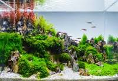
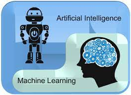
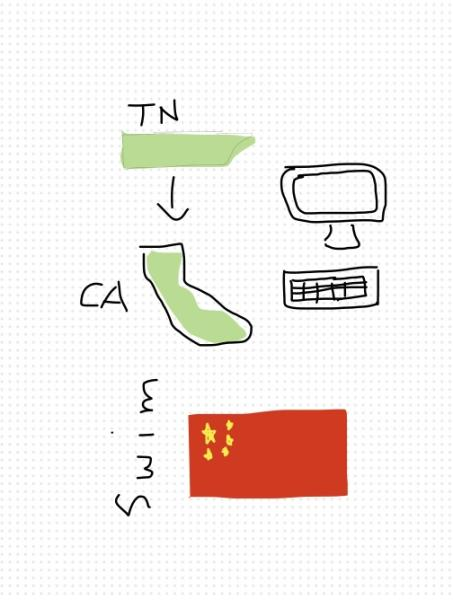

## Who Am I? How'd I come about coding?
A fish tank, dressed in light green plants and soft algae, alive with schools of joyful black skirt tetra and black neon tetras darting over me, eagerly greeting my father with a can of fish flakes is something I'd wish to experience one more time. 

When I was in elementary school, I would always sit down on a Friday night watching a show called “Tanked”. Each episode presented a new aquarium design, having complex aquatic structures that flourished with fresh or saltwater fish. I would always force my father to join me for some company even if it meant for him to fall asleep midway through. On my 10th birthday, a 29 gallon aquarium tank was brought home with different supplies to decorate it. I was unaware of its presence as I was upstairs busily building my Star Wars LEGOs I got as a gift. My dad called for me to come downstairs, and seeing an aquarium tank taller than me had me eagerly jumping.  

Having the opportunity to construct my own aquatic world like in the show "Tanked" seemed like a dream come true. Despite the fact that I hadn’t done much aquascaping previously, I gave it a few tries, even though the results weren’t spectacular. My father was always behind me, assisting me in placing where I thought the plants and structures should be placed. He offered insight for improving the tank’s appearance, which was quite helpful. As we worked, time seemed to stretch, turning seconds into hours. I felt a surge of excitement every time we placed something. My father meticulously arranged the rocks to create gentle slopes and hiding places for the fish. He supported me so I could precisely position the green aquatic plants, taking into account their height and color to ensure that everything looked beautiful together. Finally, we took a step back to evaluate what we had done. The entire arrangement came to life, depicting a serene and natural beauty that is difficult to describe. Nonetheless, sharing this experience with my father was more important than how things turned out. 

When my mom and dad initially separated during the emergence of COVID-19, I was frightened because COVID was already hard enough of an impact. My dad was the one to leave, and my mental health completely shattered from there. I kept thinking about the many disadvantages compared to the other teenagers my age. I was the only man in the family, therefore tasked with more chores and had to look out for my sister. Every day, I help with the dishes and check the doors every night to make sure everything is secured. On the weekend, I mop and vacuum. Occasionally, I help with the garden by picking up leaves or fixing the pipe systems. My father was tasked with the electrical/hands-on portion of the house, which has now become my job as well. For example, I needed to understand how to adjust water pipes, patch holes, paint the wall, fix our light bulbs, etc. Also, not having a father on the side who helps me with my teenagers hormones and to provide me tips for growing into a man has also been a lack for me. However, I’ve learned that this is irreversible and to take it in as a good thing. It helps me mature quicker into a man and allows me to learn how to work around the house earlier than most teenagers. Now that I can comfortably communicate with my mom, my life has gone back to normal and I do not feel as pressured as before. 

The deeply valued memories of bonding with my father over the fish tank discovered another arena for my problem-solving abilities and resilience: computer science. Just as my father and I meticulously planned and assembled the aquatic world in the tank, I realized that coding may enable me to build virtual answers to real-world problems. Taking AP Computer Science Principles was the one of the first opportunities I was given to learn how to code. In that class, I indulged myself in some coding fundamentals. I was fascinated by the various team-based projects we had to complete. My team and I recently finished a project that required us to use an API and create a webpage to teach others about information we extracted from the API. We created weekly reports using the analysis of continuous coronavirus data on our website. The backend and frontend of the website were coded using HTML and Python, with equal contributions from every team member. This project represented the development of my basic Python skills, enabling me to delve deeper into AI. This shift from physical to digital creation enabled me to continue my position as a caregiver, by utilizing technology to assist others and contribute to making the world a better place. 

From this course, I discovered that I enjoyed solving puzzles by creating/fixing code. One example I had difficulty on was checking whether a combination of letters, digits, and underscores were eligible for password use. I mainly used Python 2 in AP Computer Science Principles and I was not adjusted to the new shortcuts that Python 3 uses. In this case, instead of checking each variable in the string with different ‘if’ statements to target a specific characteristic, I could use functions such as “.isidentifier” and “is.digit” to simply iterate through the string and check whether or not it follows the requirement. “.isidentifier” checks if it's a valid string (letters and underscores) and “is.digit” checks if there are any digits.  

From this experience, I’ve learned a crucial lesson: there is no precise definition of success or failure in the creative process. There is no "wrong" way to aquascape, just as there is no "wrong" way to code. Each person has their own special preferences and strengths, therefore different programming languages may fit different people. Like a school of fish, we all come together as a whole to build off of each other’s ideas, just like my father and I did. 

## This is my freeform picture!

This picture describes who I am and what I love. I am Chinese and 3 things, listed in the picture, that I love are sports, my family, and my friends. Over the summer, I attended a research program and explored AI and Machine Learning. I specifically focused on Bert in NLP, which my research paper is on.

## Additional Links
Please view [here](https://pitsco.github.io/student/csa) to view my weekly progress! Or you can click the "CSA" section on the header to view the same website!