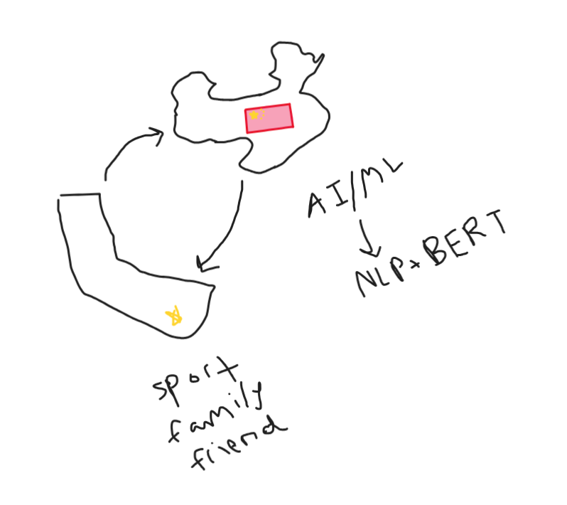

## Build you Home Page here 
This is about your journey. Start now!!!
## Overview of Hacks, Study and Tangibles
Blogging in GitHub pages is a way to learn and code at the same time. 

- Plans, Lists, [Scrum Boards](https://clickup.com/blog/scrum-board/) help you to track key events, show progress and record time.  Effort is a big part of your class grade.  Show plans and time spent!
- [Hacks(Todo)](https://levelup.gitconnected.com/six-ultimate-daily-hacks-for-every-programmer-60f5f10feae) enable you to stay in focus with key requirements of the class.  Each Hack will produce Tangibles.
- Tangibles or [Tangible Artifacts](https://en.wikipedia.org/wiki/Artifact_(software_development)) are things you accumulate as a learner and coder. 

## This is my freeform picture!

This picture describes who I am and what I love. I am Chinese and 3 things, listed in the picture, that I love are sports, my family, and my friends. Over the summer, I attended a research program and explored AI and Machine Learning. I specifically focused on Bert in NLP, which my research paper is on.